# Template Reference

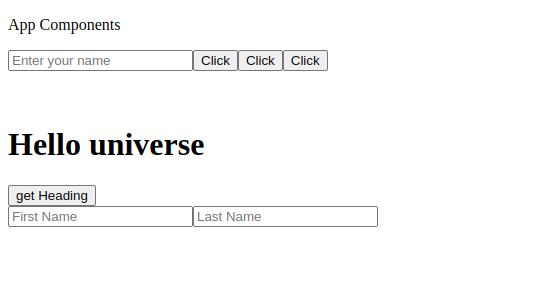
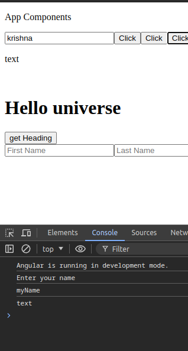
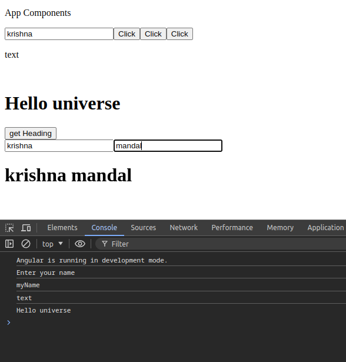
---

# Counter App
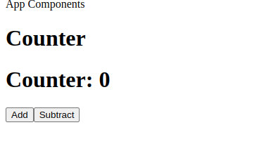
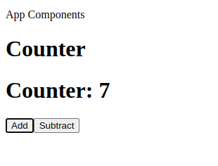
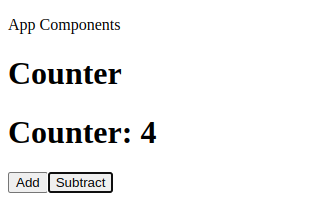
---

# Two-Way Data Binding
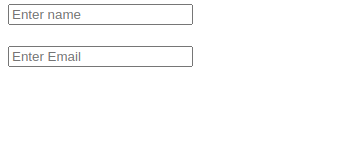
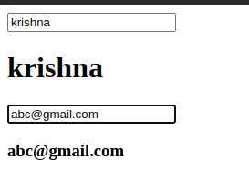
---

# Data Binding
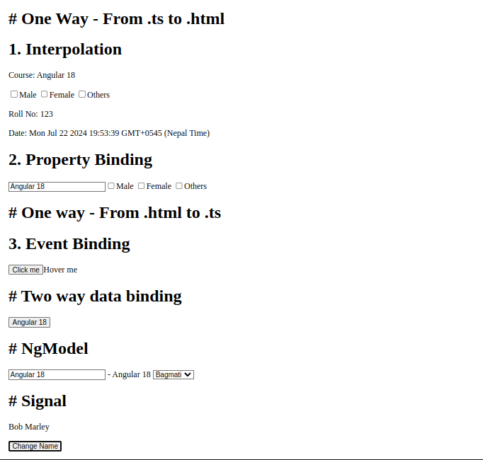
---

# ngIf Directive
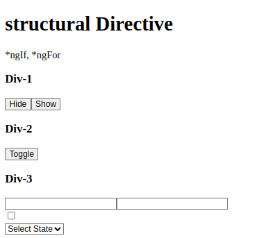

# ngFor Directive
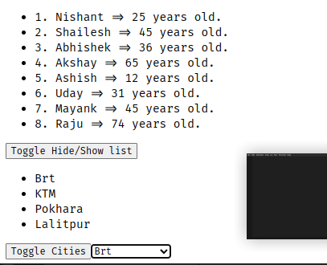
---

# ngClass, ngStyle
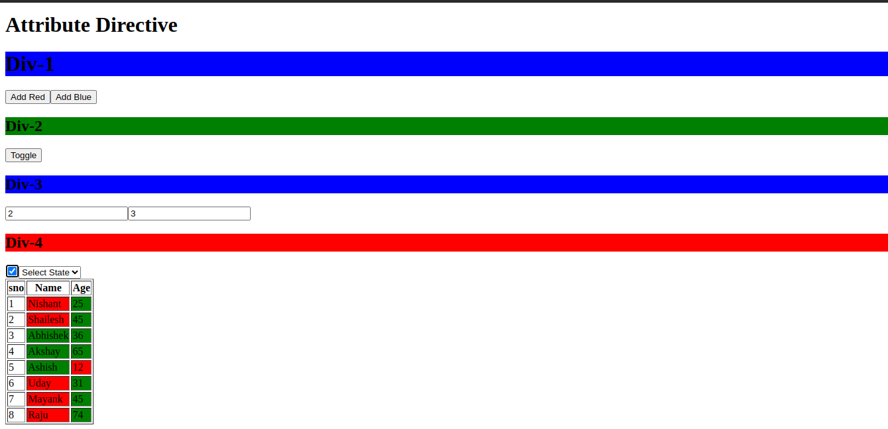
---

# Pipes And Custom Pipes
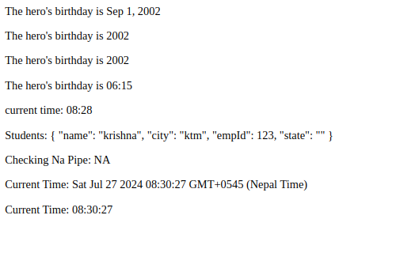
---

# Reactive Forms
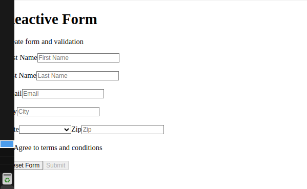
---

# Get-API httpclient
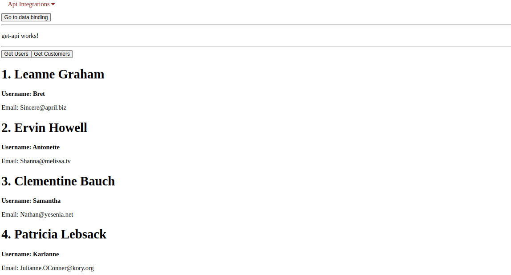
---

# Post-API 
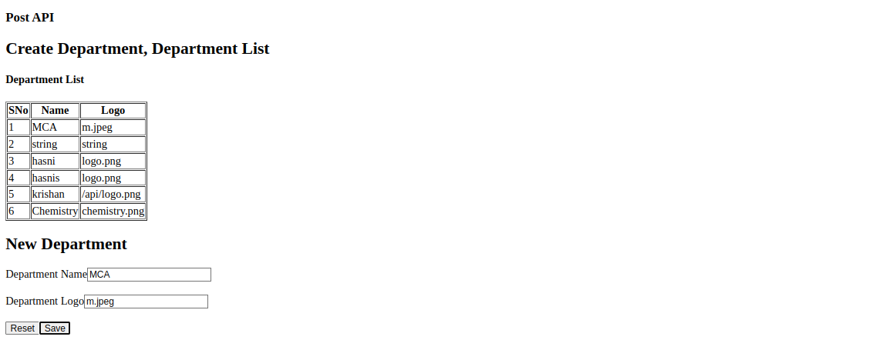
---